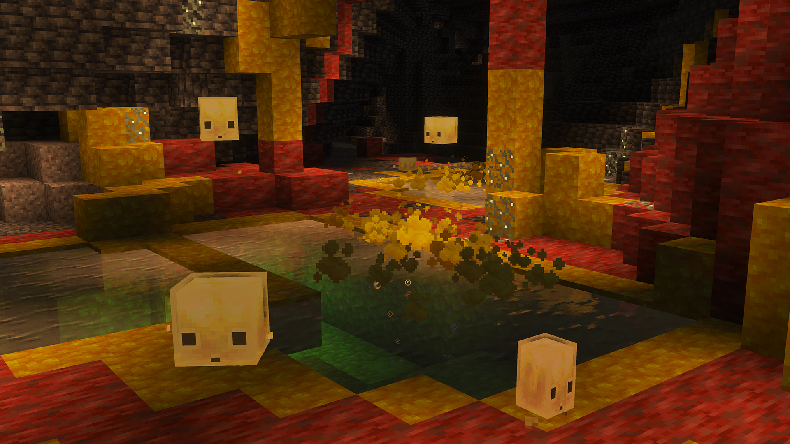

<div align="center">

  

  # 基岩版中文译名修正

  [](https://github.com/Spectrollay/mclang_cn/stargazers)
  [](https://github.com/Spectrollay/mclang_cn/releases)
  [](https://github.com/Spectrollay/mclang_cn/archive/refs/heads/main.zip)

  [](https://github.com/Spectrollay/mclang_cn/commits/main)
  [](LICENSE)

  ### 和基岩版的无脑翻译说再见!  
  **适用于所有基于基岩引擎开发的游戏版本!**  
  **独家适配隐藏内容和不同平台的独有内容!**  
  **快速适配最新的绝大多数正式版和开发版!**  

  

</div>

---

## 🤔 这是什么？

你是否曾对 Minecraft 基岩版中的某些中文翻译感到困惑和不满？**基岩版中文译名修正**项目致力于提供一套社区驱动、持续更新、极高质量的简体中文语言包。我们力求在遵循 Minecraft 官方用语习惯的基础上，结合中文语境和玩家社区的通用说法，对游戏内的文本进行精细打磨和优化，让你的 Minecraft 之旅更加顺畅沉浸。

**项目网站：** [](https://spectrollay.github.io/mclang_cn/)

**适用范围：** 完美兼容各大基于基岩引擎开发的 Minecraft 游戏版本的所有平台：基岩版（使用方式详见下方）、教育版（通过改包使用）、试玩版（通过改包使用）以及基岩版编辑器（通过改文件使用）。

---

## ✨ 项目亮点

* **🎯 精准校对**：修正官方翻译的错误、语病及不符合中文表达习惯的内容。
* **📖 语义优化**：力求译文的信、达、雅，更贴近语句段落描述的真实含义。
* **㊙️ 独家内容**：适配并翻译游戏中的隐藏文本、调试信息及部分独有内容。
* **⚡️ 快速迭代**：紧随 Minecraft 最新正式版及开发版的更新。
* **📦 轻量易用**：以标准 `.mcpack` 格式提供，导入使用便捷。
* **🌍 社区驱动**：欢迎用户积极反馈建议，共同打造最佳体验。

---

## 🚀 如何开始

### 1. 下载语言包

你可以从以下链接获取最新版本的语言包：

- [](https://github.com/Spectrollay/mclang_cn/releases/latest)   

- [](https://github.com/Spectrollay/mclang_cn/releases)   

> **注意：**
> * `正式版` 是针对游戏正式版本发布的正式更新，具体的跟进版本请在更新日志中查看。
> * `最新版` 包含了 `正式版` 和 `预览版` 标签，展示了最新的发布版本。`预览版` 是语言包的测试更新，在一般情况下包含了对游戏开发版本的适配（不一定）和语言包自身的更新，具体的更新内容请在更新日志中查看。

### 2. 安装语言包

获取语言包文件后，你可以选择以下**三种安装方式**：

#### (1) 直接使用 `.mcpack` 文件（推荐,最便捷）

这是最简单快捷的安装方式，适用于绝大多数用户。下载到 `.mcpack` 文件后，根据你的设备类型选择：

* **💻 Windows 版**：**双击** `.mcpack` 文件，Minecraft 将自动导入。如果你的设备上同时拥有多个 Minecraft 版本，你可能需要鼠标右键，在右键菜单中点击“打开方式”，选择你想要导入的版本进行导入。

* **📱 Android / iOS 版**：使用文件管理器找到 `.mcpack` 文件并**点击**。如果出现提示，选择文件类型为“文本”或“压缩包”，然后在弹出的“打开方式”中选择 Minecraft 应用（如果你的设备上同时拥有多个 Minecraft 版本请选择你想要导入的版本）进行导入。

* **🎮 主机版 (Xbox, PlayStation, Switch)**：
  * 主机平台通常**不支持直接导入** `.mcpack` 文件。
  * 一种常用方法是**通过 Minecraft Realms** 将带有资源包的世界从PC或移动版上传并同步到主机。
  * 或者，借助第三方存档编辑工具（操作可能复杂且有风险，请谨慎尝试）。

#### (2) 手动复制资源包文件夹（当自动导入失败或进行管理时）

当 `.mcpack` 自动导入无法识别到游戏，或你希望直接管理资源包文件时，可以使用此方法。

* 请将下载到的 `.mcpack` 文件更改后缀名为 `.zip`（例如，将 `CTR.mcpack` 改为 `CTR.zip`），然后将其**解压**至任一可访问的目录备用。解压后的目录结构将如下所示：
  ```
  CTR_xxx_xxx/ （解压时需保留该顶层文件夹）
  ├── texts/
  │   └── zh_CN.lang
  ├── manifest.json
  └── ... （其他资源文件）
  ```
  这里的 `CTR_xxx_xxx/` 是语言包的**顶层文件夹**，通常是一个包含版本信息的唯一名称。

* **找到游戏资源包目录**：你需要将上述解压出的 `CTR_xxx_xxx/` 文件夹复制到以下对应平台的资源包目录下：

  * **在 Windows 上**，一般位于以下路径或类似路径：
    * 正式版默认安装路径 - `C:\Users\[你的用户名]\AppData\Local\Packages\Microsoft.MinecraftUWP_8wekyb3d8bbwe\LocalState\games\com.mojang\resource_packs`
    * 测试版/预览版默认安装路径 - `C:\Users\[你的用户名]\AppData\Local\Packages\Microsoft.MinecraftWindowsBeta_8wekyb3d8bbwe\LocalState\games\com.mojang\resource_packs`
    * 正式版自定义D盘安装路径 - `D:\WpSystem\[设备标识符]\AppData\Local\Packages\Microsoft.MinecraftUWP_8wekyb3d8bbwe\LocalState\games\com.mojang\resource_packs`
    * 测试版/预览版自定义D盘安装路径 - `D:\WpSystem\[设备标识符]\AppData\Local\Packages\Microsoft.MinecraftWindowsBeta_8wekyb3d8bbwe\LocalState\games\com.mojang\resource_packs`

  * **在 Android 上**，一般位于以下路径：
    * 标准版内部存储 - `/data/user/0/com.mojang.minecraftpe/games/com.mojang/resource_packs`
    * 标准版外部存储 - `/sdcard/Android/data/com.mojang.minecraftpe/files/games/com.mojang/resource_packs`
    * 改包版内部存储（假设改包包名为`com.mojang.minecraftbe`） - `/data/user/0/com.mojang.minecraftbe/games/com.mojang/resource_packs`
    * 改包版外部存储（假设改包包名为`com.mojang.minecraftbe`） - `/sdcard/Android/data/com.mojang.minecraftbe/files/games/com.mojang/resource_packs`

  * **在 iOS 上**：
    由于 iOS 系统的严格沙盒机制，普通用户无法直接通过文件管理器访问或修改应用的内部文件。这意味着你不能像在 Windows 或 Android 上那样直接将文件复制到游戏目录中。**对于 iOS 用户，我们强烈建议使用方式一（ `.mcpack` 文件导入）来安装语言包，或者通过 Minecraft Realms 同步资源包。** 尝试手动修改文件需要越狱设备或使用复杂的第三方工具，这有较高风险且不被推荐。

* **复制文件夹**：将前面解压出的 `CTR_xxx_xxx/` 文件夹连同其内部所有文件一起复制到对应平台的 `resource_packs/` 路径下，形成如下所示的目录结构：
  ```
  ... （更高级文件夹，例如 games/com.mojang/）
  └── resource_packs/
      ├── CTR_xxx_xxx/ <-- 你复制进来的语言包文件夹
      │   ├── texts/
      │   │   └── zh_CN.lang
      │   └── manifest.json
      │   └── ... （其他资源文件）
      └── ... （其他已安装的资源包文件夹）
  ```

#### (3) 直接替换游戏核心语言文件（高级用户/有风险）

这种方式直接修改游戏安装包内的核心语言文件，无需在游戏内激活语言包。**本方法需要用户具备一定的项目开发基础和对操作系统的较高修改权限！**

**警告：除非你确切地知道你在做什么，否则请勿使用该方法！操作不当可能导致游戏损坏或无法启动。请务必在操作前备份相关文件！**

请先从下载的语言包中提取出独立的 `zh_CN.lang` 文件以供备用。

* **在 Windows 上**：
  * 你需要定位到游戏**程序安装文件夹**的数据目录。请注意，这与你平时放置资源包的`AppData`目录不同，它是受系统保护的程序目录。一般位于以下路径或类似路径（请根据你的实际版本和架构查找以 `Microsoft.MinecraftUWP_` 或 `Microsoft.MinecraftWindowsBeta_` 开头，并包含版本号和架构信息的文件夹）：
    * 正式版默认安装路径 - `C:\Program Files\WindowsApps\Microsoft.MinecraftUWP_[版本号]_[架构]__8wekyb3d8bbwe\data`
    * 测试版/预览版默认安装路径 - `C:\Program Files\WindowsApps\Microsoft.MinecraftWindowsBeta_[版本号]_[架构]__8wekyb3d8bbwe\data`
    * 正式版自定义D盘安装路径 - `D:\WindowsApps\Microsoft.MinecraftUWP_[版本号]_[架构]__8wekyb3d8bbwe\data`
    * 测试版/预览版自定义D盘安装路径 - `D:\WindowsApps\Microsoft.MinecraftWindowsBeta_[版本号]_[架构]__8wekyb3d8bbwe\data`
  * **重要提示：** 访问 `WindowsApps` 文件夹通常需要修改其权限。请谨慎操作，并确保你有管理员权限。
  * 在该数据目录（包含其子文件夹）下，使用文件查找工具搜索并**删除所有**名为 `zh_CN.lang` 的文件（**在此之前请一定要对要修改的原始文件进行备份！**）。
  * 删除成功后，定位到数据目录下的 `\resource_packs\vanilla\texts` 文件夹，将前面提取出的 `zh_CN.lang` 文件**复制进该目录**，形成如下所示的目录结构：
    ```
    ... （更高级文件夹，例如 Microsoft.MinecraftUWP_.../data）
    ├── resource_packs/
    │   ├── vanilla/
    │   │   ├── texts/
    │   │   │   ├── en_US.lang
    │   │   │   ├── zh_CN.lang <-- 这是你复制进来的修正语言文件
    │   │   │   └── ... （其他语言文件，保持不变）
    │   │   └── ... （其他安装文件，保持不变）
    │   └── ... （其他安装文件，保持不变）
    └── ... （其他安装文件，保持不变）
    ```
  * 重新启动游戏即可完成修改。

* **在 Android 上**：
  * 你需要提取出游戏的安装包，通常是 `.apk` 或 `.apks` 文件。对于 `.apks` 文件，你可能需要使用 **APK 工具**（如 `apktool`）将其转成 `.apk` 文件。
  * 使用文件浏览器或解压工具**查看** `.apk` 安装包的内容（请注意不是直接执行或安装），定位到 `/assets/assets` 数据目录。
  * 在该目录（包含子文件夹）下，查找并**删除所有** `zh_CN.lang` 文件（**在此之前请一定要对安装包文件进行备份！**）。
  * 删除成功后，定位到数据目录下的 `/resource_packs/vanilla/texts` 文件夹，将前面提取出的 `zh_CN.lang` 文件**复制进**该目录。这种方法可能会导致部分译文因键值重复而无法正确应用（重复键名的译文在修正语言文件中仅保留使用范围最广的一条，其余均已注释，你可以根据需要适当解除注释）。
  * 当然，你也可以选择不删除查找到的语言文件而是替换掉这些语言文件的内容。前面提取出的 `zh_CN.lang` 文件中的译文已经按照不同的语言文件划分了章节，你只需要找到对应的章节并将其全部复制到对应的语言文件内即可。这种方式更加完美但操作也更加繁琐，你需要替换所有 `zh_CN.lang` 文件的内容。部分章节中包含了部分被注释掉的译文，在替换完成后你也需要将这部分译文解除注释。
  * 完成文件修改后，你需要**重新打包** `.apk` 文件并**重新安装**游戏（可能需要卸载原游戏）。此步骤通常需要特定的 APK 打包工具和/或签名工具。

* **在 iOS 上**：
  * 你需要提取出游戏的安装包，通常是 `.ipa` 文件。这通常需要通过越狱设备、iTunes 或其他第三方工具来获取。
  * 使用解压工具**查看** `.ipa` 安装包的内容，定位到 `/Payload/minecraftpe.app/data` 数据目录。
  * 在该目录（包含子文件夹）下，查找并**删除所有** `zh_CN.lang` 文件（**在此之前请一定要对安装包文件进行备份！**）。
  * 删除成功后，定位到数据目录下的 `/resource_packs/vanilla/texts` 文件夹，将前面提取出的 `zh_CN.lang` 文件**复制进**该目录。这种方法可能会导致部分译文因键值重复而无法正确应用（重复键名的译文在修正语言文件中仅保留使用范围最广的一条，其余均已注释，你可以根据需要适当解除注释）。
  * 当然，你也可以选择不删除查找到的语言文件而是替换掉这些语言文件的内容。前面提取出的 `zh_CN.lang` 文件中的译文已经按照不同的语言文件划分了章节，你只需要找到对应的章节并将其全部复制到对应的语言文件内即可。这种方式更加完美但操作也更加繁琐，你需要替换所有 `zh_CN.lang` 文件的内容。部分章节中包含了部分被注释掉的译文，在替换完成后你也需要将这部分译文解除注释。
  * 完成文件修改后，你需要**重新打包** `.ipa` 文件并**重新安装**游戏。在 iOS 上安装未签名或重新签名的 `.ipa` 文件通常需要越狱或使用开发者证书及相关工具。

### 3. 激活语言包（手动修改安装文件除外）

如果你通过方式一或方式二安装了语言包，启动 Minecraft 后，按照以下步骤在游戏内激活：
1.  在主界面内找到 `设置` 按钮并点击进入。
2.  在设置页面侧边栏的“通用”章节下找到 `全局资源` 按钮并点击进入。
3.  在全局资源页面 `我的资源包` 一栏中找到“基岩版中文译名修正”资源包，点击该资源包并在下方展开菜单中选择 `激活`。
4.  确保“基岩版中文译名修正”资源包在“已激活资源包”列表的**最顶端**，以确保它能覆盖其他资源包可能做出的对官方语言文件的修改。如果它不在最顶端，你可以点击该资源包，在下方展开菜单中找到一个向上的箭头并点击，直至将资源包移至最顶端。

---

## 🤝 如何贡献

我们非常欢迎你为项目贡献力量！无论是报告错误、提出建议还是参与翻译修正：

* **发现问题或提出反馈：** 通过 [**GitHub Issues**](https://github.com/Spectrollay/mclang_cn/issues) 详细描述你的问题或建议。
* **直接参与项目开发：** 欢迎 [**Fork**](https://github.com/Spectrollay/mclang_cn/fork) 本仓库，进行修改后提交 Pull Request。

---

## 📬 联系我们

加入我们的聊天群组，参与讨论或获取帮助：

[](https://t.me/Spectrollay_MCW)   [](https://qm.qq.com/q/AqLmKLH9mM)   [](https://yhfx.jwznb.com/share?key=VyTE7W7sLwRl&ts=1684642802)

---

## 🔗 相关链接

* **本项目隶属于**: [基岩版工具包](https://github.com/Spectrollay/mcpack_bk)
* **项目网站**: [基岩版中文译名修正项目](https://spectrollay.github.io/mclang_cn/)
* **参考链接**:
    * [Minecraft Wiki](https://zh.minecraft.wiki)
    * [Crowdin](https://crowdin.com/translate/minecraft/10038/enus-zhcn)

---

## 📜 开源许可

本项目基于 [Creative Commons Attribution-NonCommercial-ShareAlike 4.0 International (CC BY-NC-SA 4.0)](LICENSE) 许可协议授权。

这意味着你可以自由地：
* **共享** — 在任何媒介以任何形式复制、发行本作品。
* **演绎** — 修改、转换或以本作品为基础进行创作。
只要你遵守许可协议条款，许可人就无法收回你的这些权利。

但同时你必须遵守下列条件：
* **署名** — 必须给出适当的署名，提供指向本许可协议的链接，同时标明是否（对原始作品）作了修改。你可以用任何合理的方式来署名，但是不得以任何方式暗示许可人为你或你的使用背书。
* **非商业性使用** — 不得将本作品用于商业目的。
* **相同方式共享** — 如果你再混合、转换或者基于本作品进行创作，必须基于与原先许可协议相同的许可协议分发你贡献的作品。
