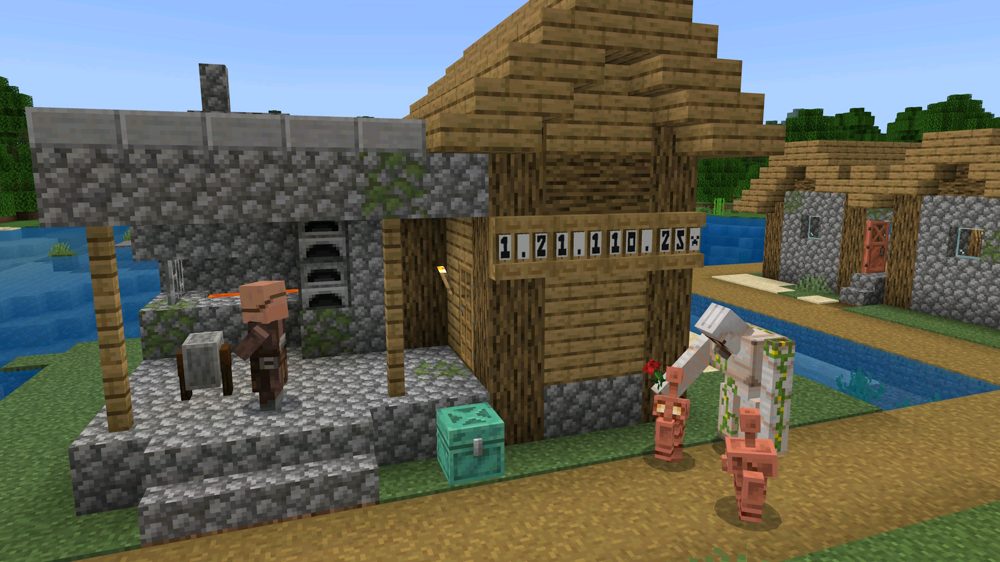

  

  # 基岩版中文译名修正

  
  
  

  
  

  ### 和基岩版的无脑翻译说再见!  
  **适用于所有基于基岩引擎开发的游戏版本!**  
  **独家适配隐藏内容和不同平台的独有内容!**  
  **快速适配最新的绝大多数正式版和开发版!**  

  

---

## 🤔 这是什么？

你是否曾对 Minecraft 基岩版中的某些中文翻译感到困惑和不满？**基岩版中文译名修正**项目致力于提供一套社区驱动、持续更新、极高质量的简体中文语言包。我们力求在遵循 Minecraft 官方用语习惯的基础上，结合中文语境和玩家社区的通用说法，对游戏内的文本进行精细打磨和优化，让你的 Minecraft 之旅更加顺畅沉浸。

**项目网站：** 

**适用范围：** 完美兼容各大基于基岩引擎开发的 Minecraft 游戏版本的所有平台：基岩版（使用方式详见下方）、教育版（通过改包使用）、试玩版（通过改包使用）以及基岩版编辑器（通过改文件使用）。

---

## ✨ 项目亮点

* **🎯 精准校对**：修正官方翻译的错误、语病及不符合中文表达习惯的内容。
* **📖 语义优化**：力求译文的信、达、雅，更贴近语句段落描述的真实含义。
* **㊙️ 独家内容**：适配并翻译游戏中的隐藏文本、调试信息及部分独有内容。
* **⚡️ 快速迭代**：紧随 Minecraft 最新正式版及开发版的更新。
* **📦 轻量易用**：以标准 `.mcpack` 格式提供，导入使用便捷。
* **🌍 社区驱动**：欢迎用户积极反馈建议，共同打造最佳体验。

---

## 🚀 如何开始

### 1. 下载语言包

你可以从以下链接获取最新版本的语言包：

-    

-    

> **注意：**
> * `正式版` 是针对游戏正式版本发布的正式更新，具体的跟进版本请在更新日志中查看。
> * `最新版` 包含了 `正式版` 和 `预览版` 标签，展示了最新的发布版本本。`预览版` 是语言包的测试更新，在一般情况下包含了对游戏开发版本的适配（不一定）和语言包自身的更新，具体的更新内容请在更新日志中查看。

### 2. 导入语言包

获取 `.mcpack` 文件后：

* **💻 Windows 版**: 双击 `.mcpack` 文件，Minecraft 将自动导入。如果你的设备上同时拥有多个 Minecraft 版本，你可能需要鼠标右键，在右键菜单中点击打开方式，选择你想要导入的版本进行导入。
* **📱 Android / iOS 版**: 使用文件管理器找到 `.mcpack` 文件并点击，选择文件类型为文本或压缩包（如有提示选择文件类型），在弹出的打开方式中选择 Minecraft 应用（如果你的设备上同时拥有多个 Minecraft 版本请选择你想要导入的版本）进行导入。
* **🎮 主机版 (Xbox, PlayStation, Switch)**:
    * 主机平台通常不支持直接导入 `.mcpack` 文件。
    * 一种常用方法是通过 Minecraft Realms将带有资源包的世界从PC或移动版上传并同步到主机。
    * 或者，借助第三方存档编辑工具（操作可能复杂，请谨慎尝试）。

### 3. 激活语言包

启动 Minecraft：
1.  在主界面内找到 `设置` 按钮点击进入。
2.  在设置页面侧边栏的通用章节下找到 `全局资源` 按钮点击进入。
3.  在全局资源页面 `我的资源包` 一栏中找到“基岩版中文译名修正”资源包，点击该资源包并在下方展开菜单中选择 `激活`。
4.  确保“基岩版中文译名修正”资源包在已激活资源包列表的**最顶端**，以覆盖其他资源包可能做出的对官方语言文件的修改。如果它不在最顶端，你可以点击该资源包，在下方展开菜单中找到一个向上的箭头并点击，直至将资源包移至最顶端。

---

## 🤝 如何贡献

我们非常欢迎你为项目贡献力量！无论是报告错误、提出建议还是参与翻译修正：

* **发现问题或提出反馈：** 通过 [**GitHub Issues**](https://github.com/Spectrollay/mclang_cn/issues) 详细描述你的问题或建议。
* **直接参与项目开发：** 欢迎 [**Fork**](https://github.com/Spectrollay/mclang_cn/fork) 本仓库，进行修改后提交 Pull Request。

---

## 📬 联系我们

加入我们的聊天群组，参与讨论或获取帮助：

      

---

## 🔗 相关链接

* **本项目隶属于**: [基岩版工具包](https://github.com/Spectrollay/mcpack_bk)
* **项目网站**: [基岩版中文译名修正项目](https://spectrollay.github.io/mclang_cn/)
* **参考链接**:
    * [Minecraft Wiki](https://zh.minecraft.wiki)
    * [Crowdin](https://crowdin.com/translate/minecraft/10038/enus-zhcn)

---

## 📜 开源许可

本项目基于 [Creative Commons Attribution-NonCommercial-ShareAlike 4.0 International (CC BY-NC-SA 4.0)](LICENSE) 许可协议授权。

这意味着你可以自由地：
* **共享** — 在任何媒介以任何形式复制、发行本作品。
* **演绎** — 修改、转换或以本作品为基础进行创作。
只要你遵守许可协议条款，许可人就无法收回你的这些权利。

但同时你必须遵守下列条件：
* **署名** — 必须给出适当的署名，提供指向本许可协议的链接，同时标明是否（对原始作品）作了修改。你可以用任何合理的方式来署名，但是不得以任何方式暗示许可人为你或你的使用背书。
* **非商业性使用** — 不得将本作品用于商业目的。
* **相同方式共享** — 如果你再混合、转换或者基于本作品进行创作，必须基于与原先许可协议相同的许可协议分发你贡献的作品。
