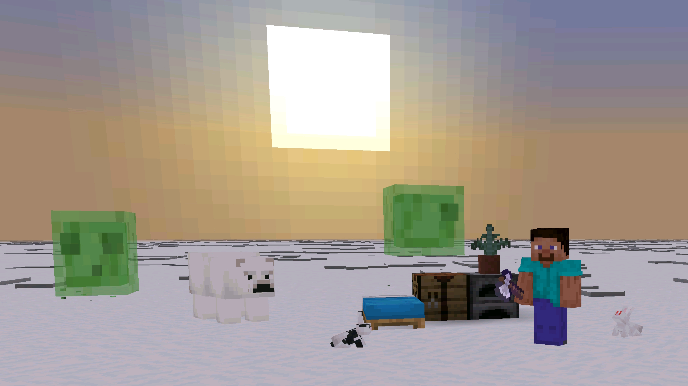

<h1>基岩版中文译名修正</h1>

<h3>和基岩版的无脑翻译说再见!</h3>

<b>适用于所有基于基岩引擎开发的游戏版本! 独家适配隐藏内容和不同平台的独有内容! 快速适配最新的绝大多数正式版和开发版!</b>

      

   

      

<b>本项目隶属于: <a href="https://github.com/Spectrollay/mcpack_bk">基岩版工具包</a></b>

<b>访问我们的网站: <a href="https://spectrollay.github.io/mclang_cn/">基岩版中文译名修正项目</a></b>

<h4>发布日期:</h4>

- 
- 

<h4>现已跟进:</h4>

- Release 1.21.44
- Beta/Preview 1.21.50.28

<h4>主要功能:</h4>

- 中文译名修正
- 支持一些隐藏内容
- 支持一些开发版独有内容
- 支持一些特定平台的特定内容

<h4>近期更新:</h4>

- 眼眸花,树脂系列方块
- 嘎枝,苍白橡木系列方块
- 适配最新版语言文件

<h4>下载:</h4>

- Release标签用于发布适配正式版的中文译名修正包
- Pre-release标签用于发布适配开发版的中文译名修正包
- [基岩版工具包](https://github.com/Spectrollay/mcpack_bk)现已默认内置正式版中文译名修正

<h4>关于:</h4>

- 
- 
